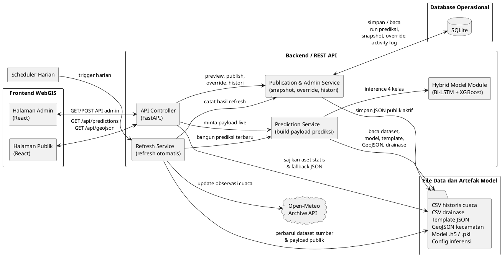
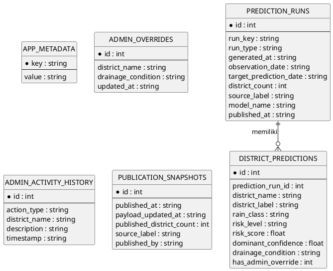
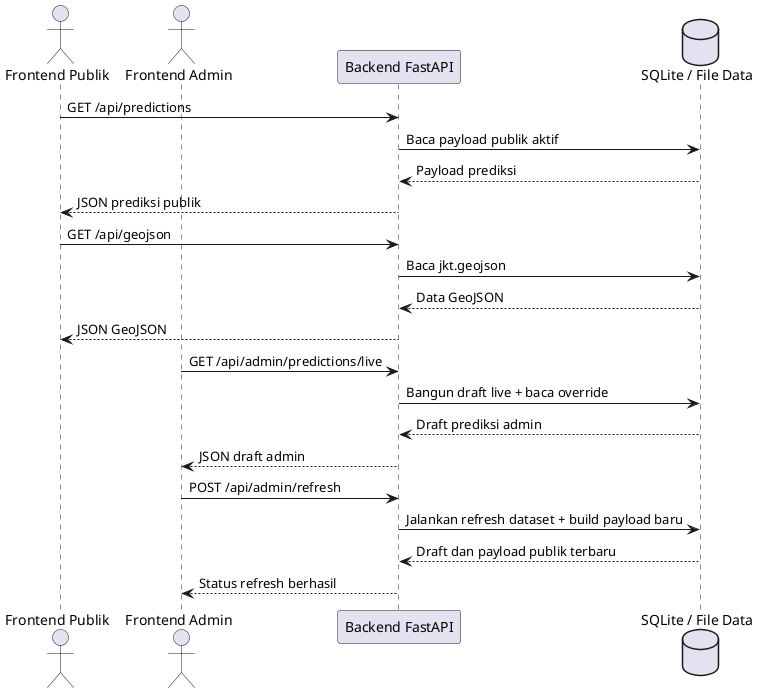
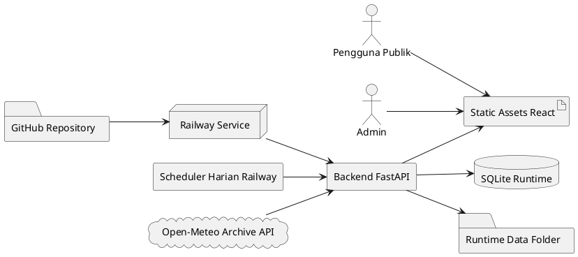
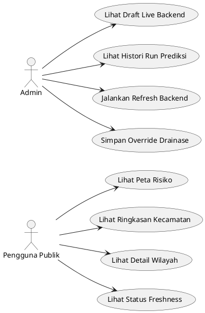
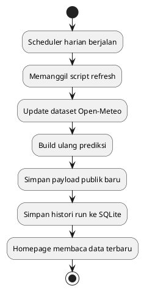
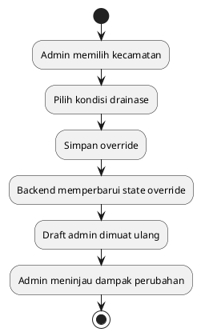
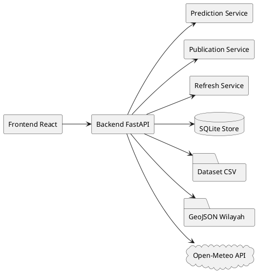

# 3.1.5 Perancangan Penelitian

Perancangan penelitian dilakukan untuk menjelaskan hubungan antara pipeline model prediksi, mekanisme pembentukan skor risiko, arsitektur sistem, basis data, layanan API, deployment, dan representasi UML pada sistem FloodGIS Jakarta Timur. Rancangan ini digunakan sebagai dasar implementasi agar proses pengambilan data cuaca, pembentukan prediksi curah hujan, penyesuaian risiko berbasis drainase, penyajian WebGIS, serta pembaruan data otomatis dapat berjalan secara terstruktur.

Pada penelitian ini, sistem yang dirancang merupakan WebGIS prediksi curah hujan dan risiko banjir untuk wilayah Jakarta Timur. Sistem memanfaatkan data historis cuaca harian, data spasial batas kecamatan, dan data drainase sebagai sumber utama. Seluruh data tersebut diproses oleh backend untuk menghasilkan prediksi kelas curah hujan, skor risiko banjir, dan payload visualisasi yang dibaca oleh halaman publik serta halaman admin.

Perancangan penelitian diarahkan untuk memenuhi dua kebutuhan utama. Pertama, sistem harus mampu membentuk prediksi curah hujan harian per kecamatan menggunakan pendekatan hybrid Bi-LSTM dan XGBoost. Kedua, sistem harus mampu menyajikan hasil prediksi tersebut ke dalam bentuk informasi spasial yang mudah dipahami melalui antarmuka WebGIS. Oleh karena itu, tahap perancangan tidak hanya berfokus pada model prediksi, tetapi juga pada integrasi antara backend, frontend, basis data, file data, dan scheduler pembaruan otomatis.

## 3.1.5.1 Perancangan Pipeline Model dan Skor Risiko

Pipeline model dan skor risiko dirancang untuk menggambarkan alur perubahan data mentah menjadi informasi prediksi yang siap divisualisasikan pada sistem WebGIS. Proses dimulai dari pengambilan data historis cuaca harian per kecamatan, kemudian dilanjutkan ke tahap preprocessing, pembentukan fitur temporal, prediksi kelas curah hujan, perhitungan skor risiko dasar, penyesuaian berbasis drainase, dan pemetaan hasil akhir ke level risiko WebGIS.

Data masukan utama sistem terdiri atas curah hujan harian, suhu rata-rata, kelembapan rata-rata, dan kecepatan angin maksimum. Selanjutnya, dari data tersebut dibentuk sejumlah fitur turunan, seperti curah hujan lag beberapa hari sebelumnya, hujan kumulatif tiga hari, hujan kumulatif tujuh hari, hujan maksimum tujuh hari, hari hujan beruntun, serta fitur musiman berbasis transformasi sinus dan cosinus. Fitur wilayah kecamatan juga disertakan untuk membedakan karakteristik spasial dari masing-masing kecamatan.

Tahap berikutnya adalah pembentukan sequence berdasarkan jendela waktu tertentu. Sequence ini digunakan sebagai masukan bagi model Bi-LSTM untuk menangkap pola temporal pada data historis cuaca. Model Bi-LSTM berperan sebagai model utama yang menghasilkan probabilitas kelas curah hujan. Selanjutnya, fitur laten dari Bi-LSTM digunakan sebagai masukan bagi model XGBoost untuk membantu meningkatkan performa klasifikasi, khususnya pada kelas yang lebih jarang, seperti hujan sedang dan hujan lebat/ekstrem.

Dalam implementasi akhir, sistem menggunakan pendekatan hybrid dengan mekanisme gated ensemble. Artinya, hasil prediksi dasar berasal dari Bi-LSTM, sedangkan XGBoost hanya diperbolehkan melakukan override pada kondisi tertentu ketika sinyal untuk kelas sedang atau lebat/ekstrem cukup kuat. Dengan pendekatan ini, sistem berusaha menjaga stabilitas prediksi sekaligus meningkatkan sensitivitas terhadap kelas hujan yang lebih kritis.

Keluaran dari tahap klasifikasi adalah kelas curah hujan empat kategori, yaitu cerah, ringan, sedang, dan lebat/ekstrem, beserta tingkat confidence-nya. Hasil tersebut kemudian dikonversi menjadi skor risiko dasar. Skor risiko dasar ini tidak langsung digunakan sebagai skor akhir, melainkan terlebih dahulu disesuaikan dengan faktor drainase wilayah. Faktor drainase dipakai sebagai layer penyesuaian terbatas yang dapat menaikkan atau menurunkan skor risiko, sesuai kondisi drainase tiap kecamatan.

Tahap terakhir adalah pemetaan skor akhir ke dalam level WebGIS. Dalam penelitian ini, skor risiko dibagi menjadi empat level, yaitu Level 1 Sangat Rendah, Level 2 Ringan, Level 3 Sedang, dan Level 4 Tinggi. Level inilah yang kemudian dipakai pada pewarnaan peta, ringkasan kecamatan, tabel prediksi, dan detail informasi wilayah.

Gambar 3.x memperlihatkan rancangan pipeline model dan skor risiko pada penelitian ini.

```plantuml
@startuml
left to right direction

rectangle "Dataset Historis Cuaca\nper Kecamatan" as Dataset
rectangle "Preprocessing Data" as Preprocess
rectangle "Pembentukan Fitur Temporal" as Feature
rectangle "Pembentukan Sequence\nper Kecamatan" as Sequence
rectangle "Model Bi-LSTM" as BiLSTM
rectangle "Fitur Laten" as Latent
rectangle "Model XGBoost" as XGB
rectangle "Prediksi Dasar\nKelas Hujan" as BasePred
rectangle "Prediksi Pendukung\nKelas Hujan" as SupportPred
rectangle "Gated Ensemble" as Gate
rectangle "Prediksi Final 4 Kelas\nCurah Hujan" as FinalClass
rectangle "Konversi ke\nSkor Risiko Dasar" as BaseRisk
rectangle "Data Drainase" as Drainage
rectangle "Penyesuaian Drainase" as DrainAdjust
rectangle "Skor Risiko Akhir" as FinalRisk
rectangle "Level Risiko WebGIS" as WebLevel
rectangle "Payload Publik dan Admin" as Payload

Dataset --> Preprocess
Preprocess --> Feature
Feature --> Sequence
Sequence --> BiLSTM
BiLSTM --> Latent
Latent --> XGB
BiLSTM --> BasePred
XGB --> SupportPred
BasePred --> Gate
SupportPred --> Gate
Gate --> FinalClass
FinalClass --> BaseRisk
Drainage --> DrainAdjust
BaseRisk --> DrainAdjust
DrainAdjust --> FinalRisk
FinalRisk --> WebLevel
WebLevel --> Payload
@enduml
```

Gambar 3.x menunjukkan bahwa proses prediksi dimulai dari dataset historis cuaca per kecamatan yang diproses melalui tahap preprocessing dan pembentukan fitur temporal. Hasil tersebut kemudian dibentuk menjadi sequence sebagai masukan bagi model Bi-LSTM. Pada rancangan ini, Bi-LSTM berperan sebagai model utama yang menghasilkan prediksi dasar kelas hujan sekaligus fitur laten. Fitur laten tersebut diteruskan ke XGBoost sebagai model pendukung agar sistem memiliki sensitivitas yang lebih baik terhadap kelas hujan yang lebih kritis.

Setelah itu, hasil prediksi dasar dari Bi-LSTM dan prediksi pendukung dari XGBoost digabungkan melalui mekanisme gated ensemble untuk membentuk prediksi final empat kelas curah hujan. Prediksi final ini kemudian dikonversi menjadi skor risiko dasar, lalu disesuaikan menggunakan data drainase untuk menghasilkan skor risiko akhir. Skor akhir tersebut dipetakan ke dalam level risiko WebGIS dan disimpan sebagai payload yang dibaca oleh halaman publik maupun halaman admin.

## 3.1.5.2 Perancangan Arsitektur Sistem

Arsitektur sistem dirancang dengan pendekatan client-server. Sistem terdiri atas frontend React sebagai antarmuka pengguna, backend FastAPI sebagai pusat pemrosesan data dan logika sistem, SQLite sebagai penyimpanan data operasional, file CSV dan JSON sebagai sumber data analitis, serta scheduler harian untuk pembaruan data otomatis.

Frontend dibagi menjadi dua bagian, yaitu halaman publik dan halaman admin. Halaman publik digunakan oleh pengguna umum untuk melihat peta risiko banjir, ringkasan prediksi setiap kecamatan, status freshness data, dan detail wilayah. Sementara itu, halaman admin digunakan untuk memantau draft live backend, melihat histori run prediksi, menjalankan refresh backend, dan melakukan override kondisi drainase apabila terdapat konteks lapangan yang perlu disesuaikan.

Backend FastAPI berfungsi sebagai penghubung utama antara model prediksi, basis data, dan frontend. Backend membaca dataset historis, membangun payload prediksi, mengelola snapshot publik, menyediakan layanan API, mengelola override drainase, dan mencatat histori aktivitas sistem. Selain itu, backend juga menjadi titik integrasi bagi scheduler harian yang bertugas memperbarui data cuaca dan membangun ulang payload prediksi secara otomatis.

Penyimpanan data pada sistem menggunakan pendekatan hybrid. Data historis cuaca, data drainase, template payload, dan data spasial GeoJSON tetap disimpan dalam bentuk file agar mudah dikelola sebagai bahan analisis. Di sisi lain, data operasional aplikasi seperti histori run prediksi, snapshot publik, aktivitas admin, dan override disimpan dalam SQLite agar lebih terstruktur untuk keperluan aplikasi.

Gambar 3.x memperlihatkan arsitektur sistem FloodGIS Jakarta Timur yang digunakan pada penelitian ini.

Gambar 3.x menunjukkan bahwa frontend WebGIS dibagi menjadi halaman publik dan halaman admin yang sama-sama berkomunikasi dengan backend FastAPI melalui REST API. Halaman publik berfokus pada visualisasi peta risiko banjir, ringkasan kecamatan, dan detail wilayah, sedangkan halaman admin digunakan untuk melihat draft live backend, memantau histori run prediksi, menjalankan refresh, dan melakukan override kondisi drainase.

Di sisi backend, API controller menjadi pintu masuk utama menuju prediction service, publication dan admin service, serta refresh service. Prediction service membaca dataset historis, file drainase, template payload, GeoJSON wilayah, serta artefak model Bi-LSTM dan XGBoost untuk membentuk prediksi curah hujan dan skor risiko. Hasil yang bersifat operasional kemudian dicatat ke SQLite, sementara payload publik aktif dan file pendukung lainnya tetap disimpan dalam storage berbasis file. Selain itu, scheduler harian menjalankan refresh service untuk memperbarui data observasi dari Open-Meteo dan membangun ulang payload prediksi yang dibaca oleh frontend.

## 3.1.5.3 Perancangan Basis Data

Basis data dirancang untuk mendukung kebutuhan operasional sistem. Pada penelitian ini, basis data yang digunakan adalah SQLite. Pemilihan SQLite didasarkan pada pertimbangan kesederhanaan deployment, kemudahan integrasi dengan Python, dan kecukupan kapasitas untuk skala aplikasi penelitian.

Basis data dirancang untuk menyimpan data yang bersifat operasional, bukan data historis mentah utama. Data historis cuaca tetap disimpan dalam file CSV, sedangkan basis data digunakan untuk menyimpan histori run prediksi, snapshot publik, aktivitas admin, dan override drainase. Dengan demikian, sistem dapat mempertahankan pemisahan yang jelas antara data analitis dan data operasional aplikasi.

Tabel `app_metadata` dirancang untuk menyimpan metadata umum aplikasi. Tabel `admin_overrides` menyimpan perubahan kondisi drainase yang dilakukan oleh admin. Tabel `admin_activity_history` mencatat aktivitas penting admin, seperti penyimpanan override dan reset override. Tabel `publication_snapshots` mencatat histori snapshot publik yang pernah dihasilkan sistem. Tabel `prediction_runs` mencatat setiap run prediksi yang berhasil dibangun, sedangkan tabel `district_predictions` menyimpan detail hasil prediksi untuk setiap kecamatan pada masing-masing run.

Relasi utama terdapat pada hubungan antara `prediction_runs` dan `district_predictions`. Satu data pada `prediction_runs` dapat memiliki banyak data terkait pada `district_predictions`, karena satu kali run prediksi menghasilkan keluaran untuk seluruh kecamatan. Relasi ini memungkinkan sistem menelusuri histori prediksi baik pada level keseluruhan run maupun pada level rincian hasil per wilayah.

Gambar 3.x memperlihatkan rancangan Entity Relationship Diagram (ERD) pada basis data FloodGIS.

Gambar 3.x menunjukkan bahwa basis data FloodGIS dibangun untuk menyimpan data yang bersifat operasional, bukan data historis mentah utama. Tabel `app_metadata` digunakan untuk menyimpan metadata aplikasi, `admin_overrides` untuk menyimpan override drainase, `admin_activity_history` untuk mencatat aktivitas admin, `publication_snapshots` untuk menyimpan histori snapshot publik, `prediction_runs` untuk mencatat setiap run prediksi, dan `district_predictions` untuk menyimpan detail hasil prediksi per kecamatan.

Relasi utama terdapat pada hubungan antara `prediction_runs` dan `district_predictions`. Satu run prediksi menghasilkan banyak detail prediksi kecamatan, sehingga relasi satu ke banyak digunakan agar histori prediksi dapat ditelusuri baik pada level keseluruhan run maupun pada level masing-masing wilayah.

## 3.1.5.4 Perancangan REST API

REST API dirancang untuk mendefinisikan komunikasi data antara frontend React dan backend FastAPI. API menggunakan format JSON agar mudah diproses oleh frontend maupun layanan lain. Dalam penelitian ini, API dibedakan menjadi dua kelompok utama, yaitu API publik dan API admin.

API publik digunakan untuk kebutuhan halaman umum. Endpoint publik mencakup endpoint untuk mengambil payload prediksi publik, endpoint untuk mengambil data GeoJSON wilayah, dan endpoint kesehatan sistem. Endpoint tersebut memungkinkan frontend publik menampilkan peta, ringkasan kecamatan, detail wilayah, dan status freshness data.

API admin digunakan untuk kebutuhan monitoring dan kontrol internal. Endpoint admin mencakup endpoint untuk membaca draft live backend, melihat histori run prediksi, menyimpan override drainase, menjalankan refresh sumber data, serta membaca ringkasan status publikasi. Dalam mode full otomatis, endpoint refresh tidak hanya membangun draft admin, tetapi juga langsung memperbarui payload publik yang dibaca homepage.

Setiap response API dirancang memiliki struktur yang konsisten. Untuk endpoint umum, struktur response dapat memuat `status`, `message`, dan `payload`. Untuk endpoint admin, response juga dapat memuat `history`, `publication`, dan `overrides`. Rancangan ini bertujuan agar frontend memiliki pola konsumsi data yang seragam dan mudah dipelihara.

Gambar 3.x memperlihatkan rancangan interaksi REST API pada sistem.

Gambar 3.x menunjukkan bahwa frontend publik menggunakan endpoint `/api/predictions` untuk membaca payload prediksi publik aktif dan endpoint `/api/geojson` untuk membaca data batas wilayah. Di sisi lain, frontend admin menggunakan endpoint `/api/admin/predictions/live` untuk membaca draft live backend serta endpoint `/api/admin/refresh` untuk menjalankan pembaruan data dan membangun ulang payload terbaru.

Melalui rancangan ini, backend bertindak sebagai penghubung utama antara frontend dan sumber data aplikasi, baik yang berasal dari SQLite maupun file data. Pola layanan seperti ini menjaga frontend tetap ringan karena seluruh proses pembentukan payload, pembacaan histori, dan pembaruan data dilakukan di sisi backend.

Tabel 3.x menunjukkan rancangan endpoint REST API yang digunakan pada sistem FloodGIS Jakarta Timur.

| Endpoint | Method | Fungsi |
| --- | --- | --- |
| `/api/health` | `GET` | Memeriksa status runtime backend |
| `/api/predictions` | `GET` | Mengambil payload prediksi publik aktif |
| `/api/geojson` | `GET` | Mengambil data batas wilayah kecamatan |
| `/api/admin/predictions/live` | `GET` | Mengambil draft live backend untuk admin |
| `/api/admin/prediction-runs` | `GET` | Mengambil histori run prediksi |
| `/api/admin/overrides` | `POST` | Menyimpan override kondisi drainase |
| `/api/admin/refresh` | `POST` | Menjalankan refresh dataset dan prediksi otomatis |

## 3.1.5.5 Perancangan Deployment Sistem

Deployment sistem dirancang agar aplikasi dapat berjalan secara online dan mendukung pembaruan data otomatis. Pada implementasi final, frontend React dibangun menjadi static assets, sedangkan backend FastAPI dijalankan sebagai service utama pada server deployment. Dengan pendekatan ini, seluruh sistem dapat diakses dari satu alamat publik, namun tetap mempertahankan pemisahan tanggung jawab antara antarmuka dan logika backend.

Platform deployment yang digunakan adalah Railway. Pemilihan platform ini didasarkan pada kemudahan integrasi dengan repository GitHub, dukungan terhadap environment variable, dukungan volume penyimpanan runtime, serta kemudahan menjalankan service Python secara langsung. Dalam konteks penelitian ini, Railway juga mempermudah pengelolaan scheduler harian untuk pembaruan data.

Pada level runtime, backend menyimpan file SQLite, payload publik aktif, file override admin, dan dataset hasil pembaruan pada direktori data runtime. Sementara itu, file statis frontend, file GeoJSON, dan file pendukung lainnya disertakan sebagai bagian dari artefak aplikasi. Melalui rancangan ini, sistem dapat membedakan file yang bersifat tetap dan file yang berubah secara dinamis selama aplikasi berjalan.

Mekanisme refresh otomatis dirancang berjalan secara harian melalui scheduler. Scheduler menjalankan script pembaruan data sumber, memperbarui dataset cuaca, membangun ulang payload prediksi, lalu langsung menulis hasil terbaru ke payload publik aktif. Dengan demikian, homepage dapat membaca hasil terbaru secara otomatis tanpa menunggu proses publish manual dari admin.

Gambar 3.x memperlihatkan rancangan deployment sistem pada penelitian ini.

### Use Case Diagram Sistem

Gambar 3.x menunjukkan bahwa repository GitHub menjadi sumber kode aplikasi yang kemudian dideploy ke Railway Service. Pada lingkungan ini, backend FastAPI dijalankan sebagai service utama, sedangkan hasil build frontend React disajikan sebagai static assets. Backend juga terhubung dengan SQLite runtime dan direktori data runtime untuk menyimpan payload publik, dataset hasil refresh, dan file override.

Selain itu, scheduler harian dijalankan pada lingkungan Railway untuk memanggil proses refresh otomatis. Scheduler mengambil data observasi dari Open-Meteo Archive API, memperbarui dataset, membangun ulang prediksi, lalu menulis hasilnya ke payload publik aktif. Dengan rancangan ini, halaman publik dapat membaca data terbaru secara otomatis tanpa memerlukan proses publish manual setiap hari.

## 3.1.5.6 Perancangan UML Sistem

UML dirancang untuk memvisualisasikan struktur dan perilaku sistem secara lebih jelas. Diagram UML digunakan agar hubungan antara aktor, komponen, dan proses utama pada aplikasi dapat dipahami secara konseptual sebelum masuk ke tahap implementasi.

Pada penelitian ini, use case diagram dirancang dengan dua aktor utama, yaitu pengguna publik dan admin. Pengguna publik menggunakan sistem untuk melihat peta risiko banjir, melihat ringkasan kecamatan, melihat detail wilayah, dan membaca status freshness data. Sementara itu, admin menggunakan sistem untuk memantau draft live backend, melihat histori run prediksi, menjalankan refresh backend, serta melakukan override drainase jika diperlukan.

Activity diagram digunakan untuk menggambarkan alur proses utama sistem. Activity diagram pertama dapat menjelaskan proses refresh harian, yaitu mulai dari scheduler memanggil backend, backend memperbarui dataset, membangun payload prediksi, lalu menyimpan hasil ke payload publik aktif. Activity diagram kedua dapat menggambarkan alur admin ketika melakukan override drainase, mulai dari memilih kecamatan, menentukan kondisi drainase, menyimpan perubahan, dan melihat hasil perubahan pada draft admin.

Sequence diagram digunakan untuk menunjukkan interaksi antarobjek atau antar komponen sistem. Sequence diagram halaman publik dapat menggambarkan bagaimana frontend meminta data prediksi ke backend, backend membaca payload publik, lalu mengembalikan hasil ke frontend. Sequence diagram admin dapat menggambarkan proses ketika admin meminta draft live backend, menjalankan refresh, atau menyimpan override.

Component diagram atau class diagram digunakan untuk menunjukkan struktur komponen utama sistem. Komponen tersebut meliputi frontend React, backend FastAPI, prediction service, publication service, refresh service, SQLite store, file dataset, file GeoJSON, serta sumber data eksternal Open-Meteo. Dengan diagram ini, keterpisahan tanggung jawab antarbagian sistem menjadi lebih mudah dianalisis.

Gambar 3.x menunjukkan bahwa aktor pada sistem terdiri atas pengguna publik dan admin. Pengguna publik berinteraksi dengan sistem untuk melihat peta risiko, ringkasan kecamatan, detail wilayah, dan status freshness data. Sementara itu, admin berinteraksi dengan sistem untuk membaca draft live backend, melihat histori run prediksi, menjalankan refresh backend, dan menyimpan override drainase.

### Activity Diagram Refresh Harian

Gambar 3.x menunjukkan alur refresh harian yang dimulai dari scheduler, dilanjutkan dengan pemanggilan script refresh, pembaruan dataset Open-Meteo, pembangunan ulang prediksi, penyimpanan payload publik baru, pencatatan histori run ke SQLite, hingga homepage membaca data terbaru yang telah dihasilkan backend.

### Activity Diagram Override Admin

Gambar 3.x menunjukkan alur ketika admin melakukan intervensi ringan pada data drainase. Proses dimulai dari pemilihan kecamatan, penentuan kondisi drainase, penyimpanan override, pembaruan state override di backend, pemuatan ulang draft admin, hingga admin meninjau dampak perubahan pada hasil prediksi wilayah terkait.

### Component Diagram Sistem

Gambar 3.x menunjukkan struktur komponen utama pada sistem FloodGIS. Frontend React berinteraksi dengan backend FastAPI, sedangkan backend meneruskan proses ke prediction service, publication service, refresh service, SQLite store, dataset CSV, GeoJSON wilayah, dan sumber data eksternal Open-Meteo. Dengan pemisahan ini, setiap komponen memiliki tanggung jawab yang jelas sehingga sistem lebih mudah dikembangkan dan dipelihara.
