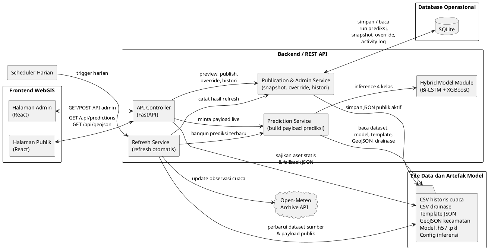

# BAB III METODE PENELITIAN

## 3.1.5 Perancangan Penelitian

Perancangan penelitian dilakukan untuk menjelaskan hubungan antara pipeline model prediksi, mekanisme pembentukan skor risiko, arsitektur sistem, basis data, layanan API, deployment, dan representasi UML pada sistem FloodGIS Jakarta Timur. Rancangan ini digunakan sebagai dasar implementasi agar proses pengambilan data cuaca, pembentukan prediksi curah hujan, penyesuaian risiko berbasis drainase, penyajian WebGIS, serta pembaruan data otomatis dapat berjalan secara terstruktur.

Pada penelitian ini, sistem yang dirancang merupakan WebGIS prediksi curah hujan dan risiko banjir untuk wilayah Jakarta Timur. Sistem memanfaatkan data historis cuaca harian, data spasial batas kecamatan, dan data drainase sebagai sumber utama. Seluruh data tersebut diproses oleh backend untuk menghasilkan prediksi kelas curah hujan, skor risiko banjir, dan payload visualisasi yang dibaca oleh halaman publik serta halaman admin.

Perancangan penelitian diarahkan untuk memenuhi dua kebutuhan utama. Pertama, sistem harus mampu membentuk prediksi curah hujan harian per kecamatan menggunakan pendekatan hybrid Bi-LSTM dan XGBoost. Kedua, sistem harus mampu menyajikan hasil prediksi tersebut ke dalam bentuk informasi spasial yang mudah dipahami melalui antarmuka WebGIS. Oleh karena itu, tahap perancangan tidak hanya berfokus pada model prediksi, tetapi juga pada integrasi antara backend, frontend, basis data, file data, dan scheduler pembaruan otomatis.

### 3.1.5.1 Perancangan Pipeline Model dan Skor Risiko

Pipeline model dan skor risiko dirancang untuk menggambarkan alur perubahan data mentah menjadi informasi prediksi yang siap divisualisasikan pada sistem WebGIS. Proses dimulai dari pengambilan data historis cuaca harian per kecamatan, kemudian dilanjutkan ke tahap preprocessing, pembentukan fitur temporal, prediksi kelas curah hujan, perhitungan skor risiko dasar, penyesuaian berbasis drainase, dan pemetaan hasil akhir ke level risiko WebGIS.

Data masukan utama sistem terdiri atas curah hujan harian, suhu rata-rata, kelembapan rata-rata, dan kecepatan angin maksimum. Selanjutnya, dari data tersebut dibentuk sejumlah fitur turunan, seperti curah hujan lag beberapa hari sebelumnya, hujan kumulatif tiga hari, hujan kumulatif tujuh hari, hujan maksimum tujuh hari, hari hujan beruntun, serta fitur musiman berbasis transformasi sinus dan cosinus. Fitur wilayah kecamatan juga disertakan untuk membedakan karakteristik spasial dari masing-masing kecamatan.

Tahap berikutnya adalah pembentukan sequence berdasarkan jendela waktu tertentu. Sequence ini digunakan sebagai masukan bagi model Bi-LSTM untuk menangkap pola temporal pada data historis cuaca. Model Bi-LSTM berperan sebagai model utama yang menghasilkan probabilitas kelas curah hujan. Selanjutnya, fitur laten dari Bi-LSTM digunakan sebagai masukan bagi model XGBoost untuk membantu meningkatkan performa klasifikasi, khususnya pada kelas yang lebih jarang, seperti hujan sedang dan hujan lebat atau ekstrem.

Dalam implementasi akhir, sistem menggunakan pendekatan hybrid dengan mekanisme gated ensemble. Artinya, hasil prediksi dasar berasal dari Bi-LSTM, sedangkan XGBoost hanya diperbolehkan melakukan override pada kondisi tertentu ketika sinyal untuk kelas sedang atau lebat atau ekstrem cukup kuat. Dengan pendekatan ini, sistem berusaha menjaga stabilitas prediksi sekaligus meningkatkan sensitivitas terhadap kelas hujan yang lebih kritis.

Keluaran dari tahap klasifikasi adalah kelas curah hujan empat kategori, yaitu cerah, ringan, sedang, dan lebat atau ekstrem, beserta tingkat confidence-nya. Hasil tersebut kemudian dikonversi menjadi skor risiko dasar. Skor risiko dasar ini tidak langsung digunakan sebagai skor akhir, melainkan terlebih dahulu disesuaikan dengan faktor drainase wilayah. Faktor drainase dipakai sebagai layer penyesuaian terbatas yang dapat menaikkan atau menurunkan skor risiko, sesuai kondisi drainase tiap kecamatan.

Tahap terakhir adalah pemetaan skor akhir ke dalam level WebGIS. Dalam penelitian ini, skor risiko dibagi menjadi empat level, yaitu Level 1 Sangat Rendah, Level 2 Ringan, Level 3 Sedang, dan Level 4 Tinggi. Level inilah yang kemudian dipakai pada pewarnaan peta, ringkasan kecamatan, tabel prediksi, dan detail informasi wilayah. Diagram pipeline model dan skor risiko disajikan pada Gambar 3.1.

### 3.1.5.2 Perancangan Arsitektur Sistem

Arsitektur sistem dirancang dengan pendekatan client-server. Sistem terdiri atas frontend React sebagai antarmuka pengguna, backend FastAPI sebagai pusat pemrosesan data dan logika sistem, SQLite sebagai penyimpanan data operasional, file CSV dan JSON sebagai sumber data analitis, serta scheduler harian untuk pembaruan data otomatis.

Frontend dibagi menjadi dua bagian, yaitu halaman publik dan halaman admin. Halaman publik digunakan oleh pengguna umum untuk melihat peta risiko banjir, ringkasan prediksi setiap kecamatan, status freshness data, dan detail wilayah. Sementara itu, halaman admin digunakan untuk memantau draft live backend, melihat histori run prediksi, menjalankan refresh backend, serta melakukan override kondisi drainase apabila terdapat konteks lapangan yang perlu disesuaikan.

Backend FastAPI berfungsi sebagai penghubung utama antara model prediksi, basis data, dan frontend. Backend membaca dataset historis, membangun payload prediksi, mengelola snapshot publik, menyediakan layanan API, mengelola override drainase, dan mencatat histori aktivitas sistem. Selain itu, backend juga menjadi titik integrasi bagi scheduler harian yang bertugas memperbarui data cuaca dan membangun ulang payload prediksi secara otomatis.

Penyimpanan data pada sistem menggunakan pendekatan hybrid. Data historis cuaca, data drainase, template payload, dan data spasial GeoJSON tetap disimpan dalam bentuk file agar mudah dikelola sebagai bahan analisis. Di sisi lain, data operasional aplikasi seperti histori run prediksi, snapshot publik, aktivitas admin, dan override disimpan dalam SQLite agar lebih terstruktur untuk keperluan aplikasi.

Gambar 3.2 memperlihatkan arsitektur sistem FloodGIS Jakarta Timur yang digunakan pada penelitian ini.

Gambar 3.2 menunjukkan bahwa frontend WebGIS dibagi menjadi halaman publik dan halaman admin yang sama-sama berkomunikasi dengan backend FastAPI melalui REST API. Halaman publik berfokus pada visualisasi peta risiko banjir, ringkasan kecamatan, dan detail wilayah, sedangkan halaman admin digunakan untuk melihat draft live backend, memantau histori run prediksi, menjalankan refresh, dan melakukan override kondisi drainase.

Di sisi backend, API controller menjadi pintu masuk utama menuju prediction service, publication dan admin service, serta refresh service. Prediction service membaca dataset historis, file drainase, template payload, GeoJSON wilayah, serta artefak model Bi-LSTM dan XGBoost untuk membentuk prediksi curah hujan dan skor risiko. Hasil yang bersifat operasional kemudian dicatat ke SQLite, sementara payload publik aktif dan file pendukung lainnya tetap disimpan dalam storage berbasis file. Selain itu, scheduler harian menjalankan refresh service untuk memperbarui data observasi dari Open-Meteo dan membangun ulang payload prediksi yang dibaca oleh frontend.

### 3.1.5.3 Perancangan Basis Data

Basis data dirancang untuk mendukung kebutuhan operasional sistem. Pada penelitian ini, basis data yang digunakan adalah SQLite. Pemilihan SQLite didasarkan pada pertimbangan kesederhanaan deployment, kemudahan integrasi dengan Python, dan kecukupan kapasitas untuk skala aplikasi penelitian.

Basis data dirancang untuk menyimpan data yang bersifat operasional, bukan data historis mentah utama. Data historis cuaca tetap disimpan dalam file CSV, sedangkan basis data digunakan untuk menyimpan histori run prediksi, snapshot publik, aktivitas admin, dan override drainase. Dengan demikian, sistem dapat mempertahankan pemisahan yang jelas antara data analitis dan data operasional aplikasi.

Tabel `app_metadata` dirancang untuk menyimpan metadata umum aplikasi. Tabel `admin_overrides` menyimpan perubahan kondisi drainase yang dilakukan oleh admin. Tabel `admin_activity_history` mencatat aktivitas penting admin, seperti penyimpanan override dan reset override. Tabel `publication_snapshots` mencatat histori snapshot publik yang pernah dihasilkan sistem. Tabel `prediction_runs` mencatat setiap run prediksi yang berhasil dibangun, sedangkan tabel `district_predictions` menyimpan detail hasil prediksi untuk setiap kecamatan pada masing-masing run.

Relasi utama terdapat pada hubungan antara `prediction_runs` dan `district_predictions`. Satu data pada `prediction_runs` dapat memiliki banyak data terkait pada `district_predictions`, karena satu kali run prediksi menghasilkan keluaran untuk seluruh kecamatan. Relasi ini memungkinkan sistem menelusuri histori prediksi baik pada level keseluruhan run maupun pada level rincian hasil per wilayah. ERD sistem disajikan pada Gambar 3.3.

### 3.1.5.4 Perancangan REST API

REST API dirancang untuk mendefinisikan komunikasi data antara frontend React dan backend FastAPI. API menggunakan format JSON agar mudah diproses oleh frontend maupun layanan lain. Dalam penelitian ini, API dibedakan menjadi dua kelompok utama, yaitu API publik dan API admin.

API publik digunakan untuk kebutuhan halaman umum. Endpoint publik mencakup endpoint untuk mengambil payload prediksi publik, endpoint untuk mengambil data GeoJSON wilayah, dan endpoint kesehatan sistem. Endpoint tersebut memungkinkan frontend publik menampilkan peta, ringkasan kecamatan, detail wilayah, dan status freshness data.

API admin digunakan untuk kebutuhan monitoring dan kontrol internal. Endpoint admin mencakup endpoint untuk membaca draft live backend, melihat histori run prediksi, menyimpan override drainase, menjalankan refresh sumber data, serta membaca ringkasan status publikasi. Dalam mode full otomatis, endpoint refresh tidak hanya membangun draft admin, tetapi juga langsung memperbarui payload publik yang dibaca homepage.

Setiap response API dirancang memiliki struktur yang konsisten. Untuk endpoint umum, struktur response dapat memuat `status`, `message`, dan `payload`. Untuk endpoint admin, response juga dapat memuat `history`, `publication`, dan `overrides`. Rancangan ini bertujuan agar frontend memiliki pola konsumsi data yang seragam dan mudah dipelihara. Sequence diagram REST API disajikan pada Gambar 3.4, sedangkan rancangan endpoint utama ditunjukkan pada Tabel 3.1.

Tabel 3.1 Rancangan endpoint REST API FloodGIS Jakarta Timur

| Endpoint | Method | Fungsi |
| --- | --- | --- |
| `/api/health` | `GET` | Memeriksa status runtime backend |
| `/api/predictions` | `GET` | Mengambil payload prediksi publik aktif |
| `/api/geojson` | `GET` | Mengambil data batas wilayah kecamatan |
| `/api/admin/predictions/live` | `GET` | Mengambil draft live backend untuk admin |
| `/api/admin/prediction-runs` | `GET` | Mengambil histori run prediksi |
| `/api/admin/overrides` | `POST` | Menyimpan override kondisi drainase |
| `/api/admin/refresh` | `POST` | Menjalankan refresh dataset dan prediksi otomatis |

### 3.1.5.5 Perancangan Deployment Sistem

Deployment sistem dirancang agar aplikasi dapat berjalan secara online dan mendukung pembaruan data otomatis. Pada implementasi final, frontend React dibangun menjadi static assets, sedangkan backend FastAPI dijalankan sebagai service utama pada server deployment. Dengan pendekatan ini, seluruh sistem dapat diakses dari satu alamat publik, namun tetap mempertahankan pemisahan tanggung jawab antara antarmuka dan logika backend.

Platform deployment yang digunakan adalah Railway. Pemilihan platform ini didasarkan pada kemudahan integrasi dengan repository GitHub, dukungan terhadap environment variable, dukungan volume penyimpanan runtime, serta kemudahan menjalankan service Python secara langsung. Dalam konteks penelitian ini, Railway juga mempermudah pengelolaan scheduler harian untuk pembaruan data.

Pada level runtime, backend menyimpan file SQLite, payload publik aktif, file override admin, dan dataset hasil pembaruan pada direktori data runtime. Sementara itu, file statis frontend, file GeoJSON, dan file pendukung lainnya disertakan sebagai bagian dari artefak aplikasi. Melalui rancangan ini, sistem dapat membedakan file yang bersifat tetap dan file yang berubah secara dinamis selama aplikasi berjalan.

Mekanisme refresh otomatis dirancang berjalan secara harian melalui scheduler. Scheduler menjalankan script pembaruan data sumber, memperbarui dataset cuaca, membangun ulang payload prediksi, lalu langsung menulis hasil terbaru ke payload publik aktif. Dengan demikian, homepage dapat membaca hasil terbaru secara otomatis tanpa menunggu proses publish manual dari admin. Diagram deployment sistem disajikan pada Gambar 3.5.

### 3.1.5.6 Perancangan UML Sistem

UML dirancang untuk memvisualisasikan struktur dan perilaku sistem secara lebih jelas. Diagram UML digunakan agar hubungan antara aktor, komponen, dan proses utama pada aplikasi dapat dipahami secara konseptual sebelum masuk ke tahap implementasi.

Pada penelitian ini, use case diagram dirancang dengan dua aktor utama, yaitu pengguna publik dan admin. Pengguna publik menggunakan sistem untuk melihat peta risiko banjir, melihat ringkasan kecamatan, melihat detail wilayah, dan membaca status freshness data. Sementara itu, admin menggunakan sistem untuk memantau draft live backend, melihat histori run prediksi, menjalankan refresh backend, serta melakukan override drainase jika diperlukan.

Activity diagram digunakan untuk menggambarkan alur proses utama sistem. Activity diagram pertama menjelaskan proses refresh harian, yaitu mulai dari scheduler memanggil backend, backend memperbarui dataset, membangun payload prediksi, lalu menyimpan hasil ke payload publik aktif. Activity diagram kedua menggambarkan alur admin ketika melakukan override drainase, mulai dari memilih kecamatan, menentukan kondisi drainase, menyimpan perubahan, dan melihat hasil perubahan pada draft admin.

Sequence diagram digunakan untuk menunjukkan interaksi antarobjek atau antarkomponen sistem. Sequence diagram halaman publik menggambarkan bagaimana frontend meminta data prediksi ke backend, backend membaca payload publik, lalu mengembalikan hasil ke frontend. Sequence diagram admin menggambarkan proses ketika admin meminta draft live backend, menjalankan refresh, atau menyimpan override.

Component diagram digunakan untuk menunjukkan struktur komponen utama sistem. Komponen tersebut meliputi frontend React, backend FastAPI, prediction service, publication service, refresh service, SQLite store, file dataset, file GeoJSON, serta sumber data eksternal Open-Meteo. Dengan diagram ini, keterpisahan tanggung jawab antarbagian sistem menjadi lebih mudah dianalisis. Use case diagram, activity diagram, dan component diagram disajikan pada Gambar 3.6 sampai Gambar 3.9.

## 3.2 Ringkasan Bab

Bab ini menjelaskan perancangan penelitian yang mencakup pipeline model prediksi, pembentukan skor risiko, arsitektur sistem, basis data, REST API, deployment, dan UML. Perancangan tersebut menunjukkan bahwa sistem FloodGIS Jakarta Timur dibangun sebagai integrasi antara model prediksi curah hujan multiclass, penyesuaian risiko berbasis drainase, backend FastAPI, frontend React, SQLite, serta scheduler harian.

Dengan rancangan ini, sistem tidak hanya diarahkan untuk menghasilkan prediksi curah hujan per kecamatan, tetapi juga untuk menyajikan hasil tersebut secara spasial, terstruktur, dan dapat diperbarui secara otomatis. Oleh karena itu, perancangan pada bab ini menjadi landasan utama bagi implementasi dan evaluasi sistem yang dibahas pada Bab IV.

# BAB IV HASIL DAN PEMBAHASAN

## 4.1 Gambaran Umum

Bab ini membahas hasil pengembangan model prediksi curah hujan dan implementasinya ke dalam WebGIS risiko banjir untuk wilayah Jakarta Timur. Pembahasan dimulai dari karakteristik data dan ketidakseimbangan kelas, dilanjutkan dengan perbandingan beberapa keluarga model, evaluasi konfigurasi akhir multiclass, dan diakhiri dengan implementasi sistem WebGIS sebagai media visualisasi hasil prediksi. Fokus utama pada bab ini tidak hanya pada nilai akurasi, tetapi juga pada kemampuan model dalam mengenali kelas hujan sedang hingga lebat atau ekstrem yang secara operasional lebih penting untuk mendukung kewaspadaan banjir.

Eksperimen akhir yang digunakan pada sistem operasional memanfaatkan data mulai 1 Januari 2005, panjang jendela input 3 hari (`time_steps = 3`), 26 fitur, serta arsitektur hybrid Bi-LSTM dan XGBoost dengan mekanisme selective override pada kelas menengah dan ekstrem. Konfigurasi ini dipilih karena memberikan kompromi terbaik antara performa umum model dan kemampuan mendeteksi kelas minoritas.

## 4.2 Karakteristik Data dan Ketidakseimbangan Kelas

Data yang digunakan berasal dari `Master_Data_Spasial_Jaktim_1990_sekarang.csv` dan mencakup 10 kecamatan di Jakarta Timur, yaitu Cakung, Cipayung, Ciracas, Duren Sawit, Jatinegara, Kramat Jati, Makasar, Matraman, Pasar Rebo, dan Pulo Gadung. Pada konfigurasi akhir dengan cutoff data mulai 1 Januari 2005, total sequence yang terbentuk sebanyak 78.460 sequence dengan 26 fitur masukan. Pembagian data dilakukan secara `chronological_per_district` dengan rasio 70% data latih, 15% data validasi, dan 15% data uji. Pada setiap kecamatan, data latih berakhir pada 16 Januari 2020, data validasi berakhir pada 7 April 2023, dan data uji dimulai pada 8 April 2023. Strategi ini dipilih agar evaluasi lebih merepresentasikan kondisi prediksi ke depan dan menghindari kebocoran informasi temporal.

Distribusi kelas pada data akhir menunjukkan ketidakseimbangan yang sangat kuat. Dari 78.460 sequence, kelas 0_Cerah berjumlah 44.264 data, kelas 1_Ringan berjumlah 29.880 data, kelas 2_Sedang berjumlah 4.180 data, dan kelas 3_Lebat atau Ekstrem hanya 166 data. Dengan kata lain, kelas ekstrem hanya sekitar 0,21% dari seluruh data. Pada set uji, kelas ekstrem juga hanya berjumlah 28 data dari total 11.780 data. Kondisi ini menjelaskan bahwa evaluasi model tidak dapat hanya bertumpu pada akurasi, karena model yang terlalu sering menebak kelas mayoritas tetap dapat terlihat baik walaupun gagal mengenali kejadian hujan ekstrem.

Untuk mengurangi dampak ketidakseimbangan, proses penyeimbangan tidak diterapkan langsung pada data mentah, melainkan pada representasi fitur laten hasil encoder. Pada data latih, distribusi awal kelas 2 dan kelas 3 masing-masing sebesar 2.281 dan 120 data. Setelah penerapan SMOTE parsial, jumlah kelas 2 meningkat menjadi 12.933 data dan kelas 3 menjadi 3.233 data, sedangkan kelas 0 dan kelas 1 dipertahankan pada jumlah aslinya. Pendekatan ini dipilih agar model memperoleh tambahan contoh pada kelas minoritas tanpa mengganggu struktur temporal data asli secara berlebihan.

## 4.3 Perbandingan Keluarga Model

Tahap awal penelitian membandingkan beberapa pendekatan, yaitu klasifikasi biner, regresi yang dipetakan kembali ke kelas hujan, two-stage classification, dan multiclass classification langsung. Perbandingan ini penting untuk menunjukkan bahwa pemilihan model akhir tidak didasarkan pada satu metrik tunggal, melainkan pada kesesuaian pendekatan terhadap karakteristik masalah banjir dan ketidakseimbangan data.

Pada pendekatan klasifikasi biner, target dibagi menjadi dua kelas, yaitu aman dan waspada. Dengan threshold operasional 0,4, model menghasilkan akurasi 95,09% dan balanced accuracy 63,56%. Namun demikian, precision untuk kelas waspada hanya 1,16%, recall 31,91%, dan F1-score 2,24%. Hasil ini menunjukkan bahwa akurasi tinggi terutama disebabkan dominasi kelas aman, sedangkan performa dalam mengidentifikasi kejadian penting masih rendah. Jika threshold diturunkan hingga 0,05, recall kelas waspada dapat naik menjadi 65,96%, tetapi precision turun menjadi 0,79%, sehingga terlalu banyak false alarm untuk dipakai sebagai dasar visualisasi publik.

Pada pendekatan regresi, model memprediksi curah hujan kontinu dan hasilnya dipetakan kembali ke empat kelas curah hujan. Kandidat terbaik pada tahap pencarian model, yaitu `XGBReg_1`, sempat mencapai akurasi 70,82%, macro recall 38,02%, dan macro F1 36,89% pada evaluasi kandidat. Namun pada hasil mapped-class akhir, performa turun menjadi akurasi 62,49%, macro recall 34,47%, dan macro F1 33,15%. Yang lebih penting, recall dan precision untuk kelas lebat atau ekstrem sama-sama 0%. Hal ini menunjukkan bahwa pendekatan regresi cenderung lebih baik untuk mendekati nilai rata-rata curah hujan, tetapi belum memadai untuk menangkap kejadian ekstrem yang justru paling krusial dalam konteks risiko banjir.

Pada pendekatan two-stage classification, proses klasifikasi dibagi menjadi tahap pemisahan awal dan tahap klasifikasi lanjutan untuk kelas menengah hingga tinggi. Pendekatan ini sempat menunjukkan hasil validasi yang cukup menarik, dengan akurasi 57,48%, macro recall 42,86%, macro F1 36,41%, dan recall kelas ekstrem 8,43% pada kandidat terbaik. Akan tetapi, performa pada set uji menurun menjadi akurasi 48,95%, macro recall 36,46%, macro F1 32,71%, dan recall kelas ekstrem 4,35%. Penurunan ini mengindikasikan bahwa model two-stage belum menunjukkan generalisasi yang stabil terhadap data uji.

Dibandingkan ketiga pendekatan sebelumnya, multiclass classification langsung memberikan hasil yang lebih seimbang. Model akhir menghasilkan akurasi 63,04%, macro recall 39,06%, macro F1 37,08%, recall kelas lebat atau ekstrem 14,29%, precision kelas lebat atau ekstrem 3,81%, dan F1-score kelas lebat atau ekstrem 6,02%. Walaupun nilai akurasinya tidak setinggi model biner dan tidak melampaui seluruh angka kandidat regresi, pendekatan ini lebih sesuai dengan tujuan penelitian karena mampu mempertahankan representasi empat kelas hujan sekaligus tetap memberikan deteksi terbatas pada kelas ekstrem.

## 4.4 Eksplorasi Konfigurasi Multiclass

Setelah keluarga model dipersempit ke multiclass classification, eksperimen dilanjutkan pada pencarian konfigurasi jendela waktu dan cutoff tahun data. Pada eksplorasi jendela waktu awal, konfigurasi `time_steps = 7` pada subset data mulai 1 Januari 2005 menunjukkan performa yang cukup baik, yaitu akurasi 63,38%, macro recall 39,84%, macro F1 37,32%, dan recall kelas ekstrem 17,86%. Sebaliknya, konfigurasi `time_steps = 5` pada subset 2010+ hanya menghasilkan akurasi 57,64%, macro recall 35,36%, macro F1 34,75%, dan recall kelas ekstrem 5,00%. Temuan ini memperlihatkan bahwa pemilihan jendela waktu memang berpengaruh terhadap kualitas representasi pola hujan.

Pada tahap seleksi akhir, eksperimen difokuskan pada beberapa cutoff data, yaitu 2003+, 2004+, 2005+, 2006+, dan 2007+. Hasilnya menunjukkan bahwa cutoff 2004+ memberikan akurasi tertinggi, yaitu 64,76%, tetapi gagal mendeteksi kelas lebat atau ekstrem dengan recall 0%. Cutoff 2003+ menghasilkan akurasi 62,16% dengan recall kelas ekstrem 3,57%. Cutoff 2006+ dan 2007+ mampu mempertahankan recall kelas ekstrem di atas 10%, tetapi precision untuk kelas ekstrem sangat rendah, masing-masing 1,43% dan 1,40%. Konfigurasi 2005+ memberikan kompromi terbaik, yaitu akurasi 63,04%, macro recall 39,06%, macro F1 37,08%, recall kelas ekstrem 14,29%, dan precision kelas ekstrem 3,81%.

Dengan demikian, konfigurasi operasional akhir ditetapkan sebagai `time_steps = 3`, `loss_mode = focal`, `training_window_start_date = 2005-01-01`, dan `ensemble_mode = gated_lstm_xgb_override`. Aturan selective override yang digunakan menetapkan threshold 0,60 untuk kelas sedang dan 0,65 untuk kelas lebat atau ekstrem. Secara konseptual, LSTM digunakan sebagai prediksi dasar, sedangkan XGBoost hanya diperbolehkan melakukan override ke kelas 2 atau kelas 3 ketika probabilitas laten cukup kuat. Strategi ini dipilih untuk menekan override yang terlalu agresif sekaligus tetap memberi peluang pada model untuk menangkap sinyal ekstrem yang sulit dipelajari hanya dari keluaran dasar LSTM.

## 4.5 Evaluasi Model Final

Model multiclass final diuji pada 11.780 data uji. Hasil evaluasi menunjukkan akurasi 63,04%, macro precision 39,06%, macro recall 39,06%, dan macro F1 37,08%. Jika dilihat per kelas, performa model relatif baik pada kelas mayoritas, yaitu kelas 0_Cerah dengan precision 73,15%, recall 70,98%, dan F1-score 72,05%, serta kelas 1_Ringan dengan precision 54,54%, recall 63,37%, dan F1-score 58,62%. Pada kelas 2_Sedang, precision turun menjadi 24,73%, recall 7,62%, dan F1-score 11,66%. Sementara itu, pada kelas 3_Lebat atau Ekstrem, model memperoleh precision 3,81%, recall 14,29%, dan F1-score 6,02%.

Hasil tersebut menunjukkan bahwa model sudah mampu mengenali sebagian kejadian ekstrem, tetapi performanya masih terbatas. Dari confusion matrix, hanya 4 dari 28 data kelas lebat atau ekstrem yang berhasil dikenali dengan benar. Sebanyak 20 data ekstrem justru diprediksi sebagai kelas ringan dan 4 data lainnya diprediksi sebagai kelas sedang. Pola yang sama juga terlihat pada kelas sedang, di mana hanya 69 dari 905 data yang dikenali dengan benar, sementara 627 data sedang bergeser ke kelas ringan. Temuan ini mengindikasikan bahwa batas antar kelas hujan menengah hingga tinggi masih sulit dipisahkan secara tegas oleh model, terutama ketika pola temporal dan fitur cuaca antarkelas saling beririsan.

Walaupun demikian, hasil ini tetap lebih bermanfaat untuk tujuan WebGIS dibandingkan model yang sama sekali tidak mampu menangkap kelas ekstrem. Dalam konteks sistem peringatan visual, recall kelas ekstrem yang belum tinggi masih lebih berguna dibandingkan model yang hanya memberikan akurasi tinggi pada kelas mayoritas. Oleh karena itu, model akhir diposisikan sebagai alat bantu visualisasi dan prioritisasi wilayah, bukan sebagai pengganti keputusan operasional final.

## 4.6 Implementasi WebGIS

Model akhir kemudian diintegrasikan ke dalam sistem WebGIS risiko banjir Jakarta Timur. Halaman publik menampilkan ringkasan seluruh kecamatan, statistik singkat, peta risiko berbasis Leaflet, serta panel detail kecamatan. Setiap kecamatan divisualisasikan berdasarkan level risiko WebGIS, skor risiko, kelas hujan prediksi, dan informasi pendukung seperti kondisi drainase. Sistem juga menampilkan catatan model di halaman publik agar pengguna memahami bahwa hasil prediksi ini merupakan visualisasi pendukung dan bukan peringatan operasional final.

Halaman admin disediakan sebagai panel preview hasil model. Pada halaman ini, admin dapat melihat status sumber data, waktu observasi terakhir, target tanggal prediksi, model aktif, sumber curah hujan, sumber data drainase, histori run prediksi, serta detail prediksi setiap kecamatan. Admin juga dapat menjalankan refresh backend dan melakukan override drainase apabila terdapat konteks lapangan yang perlu disesuaikan.

Dari sisi backend, sistem mengirimkan metadata freshness seperti `latestObservationDate`, `forecastTargetDate`, `updatedAt`, dan `observationAgeDays`. Informasi ini penting agar pengguna dapat menilai apakah prediksi yang sedang dilihat berasal dari data yang masih segar atau sudah mulai usang. Jika API backend tidak tersedia, sistem dapat menggunakan fallback JSON dan menampilkan notifikasi yang jelas bahwa data yang sedang digunakan adalah data cadangan. Pendekatan ini meningkatkan robustness sistem, karena peta tetap dapat dibuka meskipun sumber utama sedang gagal dimuat.

Untuk kebutuhan deployment, halaman admin tidak dibiarkan terbuka bebas pada lingkungan produksi. Sistem mendukung proteksi berbasis Basic Auth melalui environment variable `ADMIN_USERNAME` dan `ADMIN_PASSWORD`. Dengan demikian, hasil model yang lebih rinci dan metadata backend hanya dapat diakses oleh pihak yang berwenang, sementara halaman publik tetap berfungsi sebagai kanal visualisasi informasi untuk pengguna umum.

## 4.7 Pembahasan

Secara umum, hasil penelitian menunjukkan bahwa tantangan utama bukan terletak pada menghasilkan akurasi tinggi, melainkan pada mengenali kejadian hujan sedang dan lebat atau ekstrem yang jumlahnya sangat sedikit. Ketidakseimbangan data yang ekstrem membuat model cenderung belajar pola kelas mayoritas lebih cepat dibandingkan pola kelas minoritas. Fakta bahwa kelas lebat atau ekstrem hanya memiliki 166 data pada keseluruhan dataset akhir dan 28 data pada set uji menjadi salah satu penyebab utama rendahnya precision dan recall pada kelas ini.

Penerapan SMOTE parsial, focal loss, dan selective override dari XGBoost terbukti membantu model untuk mulai menangkap sebagian kejadian ekstrem, walaupun peningkatannya masih terbatas. Di sisi lain, eksperimen juga memperlihatkan bahwa optimasi terhadap akurasi saja dapat menghasilkan pilihan model yang menyesatkan. Model cutoff 2004+ misalnya, memiliki akurasi tertinggi, tetapi tidak mendeteksi satu pun kejadian ekstrem. Oleh sebab itu, metrik seperti macro recall, macro F1, dan recall kelas kritis lebih relevan untuk dijadikan dasar pemilihan model pada studi ini.

Implementasi ke dalam WebGIS memperlihatkan bahwa model tidak hanya perlu baik secara numerik, tetapi juga harus dapat dijelaskan dan digunakan secara praktis. Penambahan indikator freshness, status live atau fallback, catatan akurasi model, serta pemisahan halaman publik dan admin menunjukkan bahwa aspek usability dan governance sama pentingnya dengan performa model itu sendiri. Sistem yang dihasilkan belum dapat disebut sebagai sistem peringatan dini operasional penuh, tetapi sudah memadai sebagai prototipe decision-support untuk visualisasi risiko banjir berbasis prediksi curah hujan.

## 4.8 Ringkasan Bab

Berdasarkan seluruh rangkaian eksperimen, pendekatan multiclass classification langsung dengan arsitektur hybrid Bi-LSTM dan XGBoost dipilih sebagai model akhir karena memberikan keseimbangan terbaik antara performa umum dan kemampuan mendeteksi kelas ekstrem. Konfigurasi operasional yang digunakan adalah data mulai 1 Januari 2005, panjang jendela 3 hari, focal loss, dan selective override pada kelas 2 serta kelas 3. Model ini mencapai akurasi 63,04%, macro recall 39,06%, macro F1 37,08%, dan recall kelas lebat atau ekstrem 14,29% pada data uji.

Hasil model tersebut kemudian berhasil diintegrasikan ke dalam WebGIS Jakarta Timur yang menyediakan visualisasi peta risiko, detail prediksi per kecamatan, indikator freshness data, fallback data cadangan, serta panel admin yang lebih aman untuk monitoring internal. Dengan demikian, penelitian ini tidak hanya menghasilkan model prediksi, tetapi juga menghasilkan prototipe sistem yang dapat digunakan untuk mendukung interpretasi risiko banjir secara spasial.

# BAB V PENUTUP

## 5.1 Kesimpulan

Berdasarkan hasil perancangan, implementasi, dan evaluasi yang telah dilakukan, dapat disimpulkan beberapa hal sebagai berikut.

1. Penelitian ini berhasil merancang pipeline prediksi curah hujan multiclass berbasis data historis cuaca harian per kecamatan di Jakarta Timur. Pipeline tersebut mencakup preprocessing data, pembentukan fitur temporal, pembentukan sequence, klasifikasi curah hujan menggunakan pendekatan hybrid Bi-LSTM dan XGBoost, konversi ke skor risiko dasar, serta penyesuaian skor berbasis kondisi drainase.

2. Model akhir yang dipilih adalah multiclass classification langsung dengan konfigurasi data mulai 1 Januari 2005, panjang sequence 3 hari, focal loss, dan gated ensemble antara Bi-LSTM dan XGBoost. Konfigurasi ini dipilih karena memberikan kompromi terbaik antara performa umum dan kemampuan mendeteksi kelas minoritas, khususnya hujan lebat atau ekstrem.

3. Pada data uji, model final menghasilkan akurasi 63,04%, macro recall 39,06%, dan macro F1 37,08%. Untuk kelas lebat atau ekstrem, model memperoleh recall 14,29% dan precision 3,81%. Hasil ini menunjukkan bahwa model belum sepenuhnya optimal dalam mengenali kejadian ekstrem, tetapi sudah mampu menangkap sebagian sinyal penting yang sebelumnya sulit dikenali oleh pendekatan lain seperti regresi maupun klasifikasi biner.

4. Penelitian ini juga menunjukkan bahwa akurasi tidak dapat dijadikan satu-satunya dasar pemilihan model pada kasus prediksi curah hujan untuk kebutuhan risiko banjir. Model dengan akurasi tertinggi belum tentu paling sesuai apabila gagal mendeteksi kelas hujan sedang dan lebat atau ekstrem. Oleh karena itu, metrik seperti macro recall, macro F1, dan recall kelas kritis menjadi lebih relevan dalam konteks penelitian ini.

5. Model yang dihasilkan berhasil diintegrasikan ke dalam sistem WebGIS FloodGIS Jakarta Timur. Sistem ini mampu menampilkan visualisasi risiko banjir berbasis peta, ringkasan kecamatan, detail wilayah, metadata freshness data, histori prediksi, dan panel admin untuk monitoring internal. Dengan integrasi tersebut, hasil prediksi tidak hanya berhenti pada tingkat model, tetapi dapat dimanfaatkan sebagai alat bantu visualisasi dan prioritisasi wilayah secara spasial.

6. Sistem yang dibangun mendukung pembaruan data otomatis melalui scheduler harian, penggunaan fallback ketika sumber utama gagal dimuat, serta proteksi akses admin pada lingkungan produksi. Dengan demikian, penelitian ini tidak hanya menghasilkan model prediksi, tetapi juga menghasilkan prototipe sistem prediksi dan visualisasi risiko banjir yang lebih siap untuk dioperasikan sebagai decision-support tool.

## 5.2 Saran

Berdasarkan keterbatasan dan hasil penelitian, beberapa saran untuk pengembangan selanjutnya adalah sebagai berikut.

1. Penelitian selanjutnya dapat menambah jumlah dan keragaman data observasi, terutama pada kelas hujan lebat atau ekstrem, agar model memiliki representasi yang lebih baik terhadap kejadian langka. Penambahan data ini penting untuk meningkatkan stabilitas model pada kelas risiko tinggi.

2. Pengembangan berikutnya dapat mengeksplorasi arsitektur model lain, seperti Transformer time series, Temporal Convolutional Network, atau ensemble yang lebih adaptif, kemudian membandingkannya secara adil dengan konfigurasi hybrid Bi-LSTM dan XGBoost yang digunakan pada penelitian ini.

3. Penilaian faktor drainase dapat diperkuat lebih lanjut melalui penambahan indikator yang lebih lengkap, seperti dimensi saluran, kapasitas tampung, kondisi sedimentasi, riwayat genangan, atau data survei lapangan yang tervalidasi. Dengan demikian, penyesuaian skor risiko tidak hanya bergantung pada ringkasan kondisi drainase yang terbatas.

4. Sistem WebGIS dapat dikembangkan lebih lanjut dengan menambahkan histori prediksi per kecamatan, grafik tren hujan, notifikasi otomatis, serta integrasi dengan sumber data operasional lain agar interpretasi risiko menjadi lebih kaya dan lebih informatif bagi pengguna.

5. Dari sisi deployment, pengembangan selanjutnya dapat mempertimbangkan penggunaan arsitektur frontend dan backend yang dipisah penuh, monitoring log yang lebih formal, backup database otomatis, serta pengelolaan role admin yang lebih rinci apabila sistem diarahkan untuk penggunaan operasional yang lebih luas.

6. Penelitian ini masih menempatkan hasil prediksi sebagai alat bantu visualisasi dan bukan peringatan operasional final. Oleh karena itu, pada pengembangan berikutnya perlu dilakukan evaluasi bersama instansi terkait agar sistem dapat diselaraskan dengan kebutuhan operasional lapangan, validasi domain, dan kebijakan diseminasi informasi publik.

## Catatan Akhir Draft

Draft ini disusun untuk menyesuaikan gaya penulisan skripsi formal dengan konteks project FloodGIS Jakarta Timur yang saat ini menggunakan arsitektur React, FastAPI, SQLite, scheduler harian, serta model hybrid Bi-LSTM dan XGBoost. Untuk kebutuhan final skripsi, bagian ini masih dapat dilanjutkan dengan penomoran gambar dan tabel yang pasti, penyisipan hasil visual, sitasi pustaka pada tiap subbab, serta penyelarasan format sesuai template kampus.
